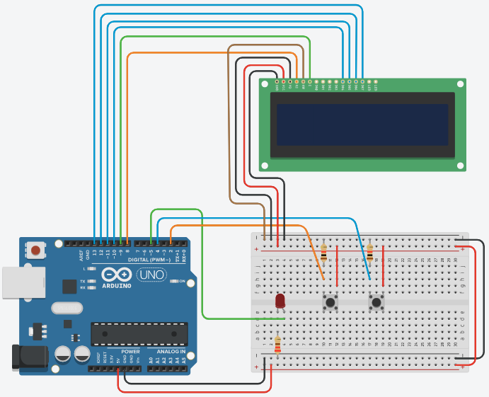

# arduino timer interrupt
Simple concept implementation of using Timer 1 registers and ISR in arduino uno

## Circuit Scheme

## Components
* Arduino Uno board (ATMega328P microcontroller)
* Breadboard
* 2 push buttons
* 1 LED
* 2 resistors 1kΩ, 1 resistor 220Ω
* LCD 16x2
* Jumper cables

## Pin Configuration
### LCD
| LCD pins | Arduino |
|---|---|
| VSS | +5V |
| VDD | GND |
| V0  | GND |
| RS  | 8   |
| RW  | GND |
| E   | 9   |
| D4  | 10  |
| D5  | 11  |
| D6  | 12  |
| D7  | 13  |
| A   | +5V |
| K   | GND |